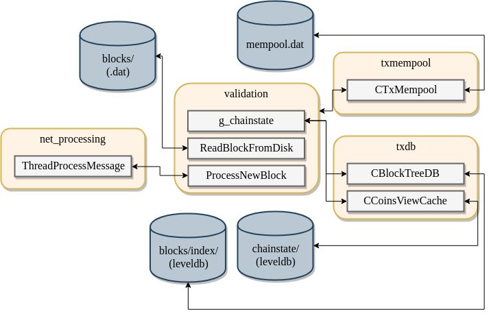
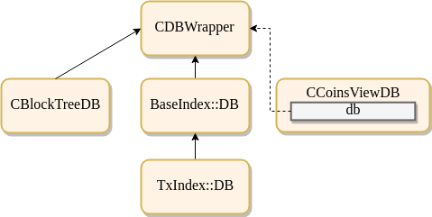

class: left, bottom, nonumber, title, split-33


## Bitcoin Core<br> .stroke[architecture overview]

.column[
Dev++ 2018<br /> Keio University, Tokyo
]

.column[
[@jamesob](https://twitter.com/jamesob)<br />Chaincode Labs
]

.column[

]

---

## Agenda

0. General introduction
0. User interfaces
0. Concurrency model
0. Regions
0. Storage
0. Data structures
0. Future work

<!--
0. Libs
0. Examples
   - Accepting a new block
   - Mining a block
   - Constructing a transaction
   - Looking up a transaction (`getrawtransaction`)
   - Building and maintaining a transaction index (`txindex`)
0. Future work
-->

---

### Introduction

Bitcoin Core serves a number of uses:

- A validating relay node in the peer-to-peer network
  - Blocks (chainstate) and transactions (mempool)

--

- A canonical wallet implementation
  - A GUI/RPC tool for end-users
  - A working example for wallet implementers (e.g. coin selection)

--

- Block assembly and submission for miners

--

- A programmatic interface for Bitcoin applications
  - RPC via HTTP, CLI

--

- (Kind-of-not-really) a reusable library for validation, serialization

---

### Introduction

In this talk, we will discuss the structure of the Bitcoin Core software and
how it accomplishes these uses, including

- .bold[concurrency model]: how do we do multiple things simultaneously?

--

- .bold[regions]: what are the major subsystems?

--

- .bold[storage]: how do we store and access data on disk?

--

- .bold[data structures]: how is data represented and manipulated in memory?

---

### Introduction

I'm going to gloss over:

- Any and all cryptographic implementations
- Details of P2P message protocol
- Graphical code (`qt/`)
- Test framework (`test/`)
- Exact validation semantics

...or basically anything really detailed.

This is purely about the organization and mechanism of code and a few
important data structures.

---

### Introduction

I've probably forgotten a few things, so feel free to shout out or ask
questions.

--

Aaaand it's really hard to do this talk without circular dependencies.

Almost certainly I'll refer to the same thing multiple times.

---

class: center, middle, hasbg, nonumber

# User interfaces

---

## User interfaces

Before jumping into the structure of the software itself, let's talk about
the user interfaces that Bitcoin provides.

---

### .subsec[User interfaces >] P2P

- Bitcoin forms a TCP overlay network of nodes passing messages to one another
  - Messages defined in `src/protocol.h`

--

- Each node has a set of outbound and inbound peers they exchange data with
  - `-addnode=<addr>`
  - `-maxconnections=<n>`
  - `net.h MAX_OUTBOUND_CONNECTIONS, DEFAULT_MAX_PEER_CONNECTIONS`

--

- Peers can be manually added (`-addnode`) or are discovered from
  DNS seeds: DNS servers that randomly resolve to known Bitcoin nodes

--

- DoS protection is implemented to prevent malicious peers from disrupting the
  network
  - `-banscore=<n>` configures sensitivity, defaults to `100`

--

- SPV (simple payment verification) nodes retrieve txout proofs

---

### .subsec[User interfaces >] RPC/HTTP

A remote procedure call (RPC) interface allows users to programmatically
interact with Bitcoin Core over HTTP

- Block explorers can query blockchain and mempool data

- External wallets can construct and sign transactions

- Miners and pool operators use `getblocktemplate` for block construction

- `bitcoin-cli` provides a way to access this interface on the commandline

---

### .subsec[User interfaces >] Qt

The Qt interface reveals

- wallet functionality
- basic network statistics
- RPC console


.center[]

---

### .subsec[User interfaces >] ZMQ

The ZMQ interface publishes notfications over a socket upon receipt of a

- new block (raw): `rawblock`
- new block (hash): `hashblock`
- new transaction (raw): `rawtx`
- new transaction (hash): `hashtx`

which allows external software to perform some action on these events:


```python
# From `contrib/zmq/zmq_sub.py`

zmqSubSocket = self.zmqContext.socket(zmq.SUB)
zmqSubSocket.setsockopt_string(zmq.SUBSCRIBE, "hashblock")
msg = await zmqSubSocket.recv_multipart()
topic, body, *_ = msg

if topic == b"hashblock":
    print('saw hashblock')
    print(binascii.hexlify(body))
```

See also: `-blocknotify=<cmd_str %s>`

---

class: center, middle, hasbg, nonumber

# Concurrency model

---

## Concurrency model

- Bitcoin Core performs a number of tasks simultaneously

--

- It has a model of concurrent execution to support this based on
  `{std,boost}::threads`, shared state, and a number of locks.

--

- P2P networking is enabled by a single `select` loop
  (`CConman::ThreadSocketHandler`)
  - We may replace `select` with `poll`
    ([#14336](https://github.com/bitcoin/bitcoin/pull/14336)) to avoid file
    descripter limits

--

.bold[However,]

All changes to chainstate are effectively single-threaded. Thanks, `cs_main`.

---

class: threads

### .subsec[Concurrency model >] threads

| Purpose                 | # threads | Task run           |
| :---------------------- | :---------------- | :-------------------- |
| Script verification | `nproc or 16`*   | `ThreadScriptCheck()` |
| Loading blocks  | 1   | `ThreadImport()` |
| Servicing RPC calls | 4*| `ThreadHTTP()` |
| Load peer addresses from DNS seeds | 1 | `ThreadDNSAddressSeed()` |
| Send and receive messages to and from peers     | 1 | `ThreadSocketHandler()` |
| Initializing network connections | 1 | `ThreadOpenConnections()` |
| Opening added network connections | 1 | `ThreadOpenAddedConnections()` |
| Process messages from `net` -> `net_processing` | 1 | `ThreadMessageHandler()` |

\* can be overridden

???

- Uses `select` which creates file descriptor related limitations

TODO: what does loading blocks do?
TODO: research select poll


---

class: threads

### .subsec[Concurrency model >] threads (continued)


| Purpose                 | # threads | Task run           |
| :---------------------- | :---------------- | :-------------------- |
| Tor control | 1 | `TorControlThread()` |
| Wallet notify (`-walletnotify`) | 1 | user-specified |
| txindex building | 1   | `ThreadSync()` |
| Block notify (`-blocknotify`) | 1   | user-specified |
| Upnp connectivity | 1   | ThreadMapPort |
| `CScheduler` service queue<br />(powers `ValidationInterface`) | 1   | `CScheduler::serviceQueue()` |

???

- TODO: understand Unpn better

---

### .subsec[Concurrency model >] `ValidationInterface`

Allows the asynchronous decoupling of chainstate events from various
responses.

--

Uses `SingleThreadedSchedulerClient` to queue responses and execute them
out-of-band w.r.t. things like network communications, though still often
blocked on lock acquisition, e.g. `cs_main`.

--

Used (subclassed) for many things:
- Index building (`src/index/bash.h:BaseIndex`)
- Triggering announcements to peers (`net_processing:PeerLogicValidation`)
- Triggering wallet updates (`wallet/wallet.h:CWallet`)
- Sending ZMQ publications (`CZMQNotificationInterface`)


???

TODO: understand the PeerLogicValidation bit better

---

### .subsec[Concurrency model >] `ValidationInterface`

Events you can make use of:

- UpdatedBlockTip
- TransactionAddedToMempool
- TransactionRemovedFromMempool
- BlockConnected
- BlockDisconnected
- ChainStateFlushed
- ResendWalletTransactions
- BlockChecked
- NewPoWValidBlock

---

### .subsec[Concurrency model >] Exercises

- Grep for `CCriticalSection` to find (most) lock definitions.
- Grep for `TraceThread` to find threads and where they are spawned.

---

class: center, middle, hasbg, nonumber

# Regions

---

## Regions

"Regions" of code (in my terms) consist of state and procedures necessary for
Bitcoin's operation.

Each region is a subsystem within Bitcoin Core that handles a certain
domain of tasks at a certain layer of abstraction.

Starting here will give us a high-level but specified sense of
which parts of the system do what tasks.

---

class: regions-summary


### Regions summary
 
| Name                 | Purpose |
| :---------------------- | :---------------- |
| `net` | Handles socket networking, tracking of peers |
| `net_processing` | Routes P2P messages into validation calls and response P2P messages |
| `validation` | Defines how we update our validated state (chain, mempool) |
| `txmempool` | Mempool data structures |
| `coins & txdb` | Interface for in-memory view of the UTXO set |
| `script/` | Script execution and caching |
| `consensus/` | Consensus params, Merkle roots, some TX validation |
| `policy/` | Fee estimation, replace-by-fee |
| `indexes/` | Peripheral index building (e.g. `txindex`) |
| `wallet/` | Wallet db, coin selection, fee bumping |
| `rpc/` | Defines the RPC interface |

                

---

### .subsec[Regions >] `net.{h,cpp}`

`net` is the "bottom" of the Bitcoin core stack. It handles network
communication with the P2P network.

It contains addresses and statistics (`CNodeStats`) for peers (`CNode`s) that
the running node is aware of.

`CConman` is the main class in this region - it manages socket connections (and
network interaction more generally) for each peer, and forwards messages to the
`net_processing` region (via `CConman::ThreadMessageHandler`).

The globally-accessible `CConman` instance is called `g_conman`.

???

- Point out the naming convention: `g_` for globals.

---

### .subsec[Regions >] `net_processing.{h,cpp}`

`net_processing` adapts the network layer to the chainstate validation layer.
It translates network messages into calls for local state changes.

--

"Validation"-specific (i.e. information relating to chainstate) data is
maintained per-node using `CNodeState` instances.

--

Much of this region is `ProcessMessage()`: a giant conditional for rendering
particular network message types to calls deeper into Bitcoin, e.g.

- `NetMsgType::BLOCK` -> `validation:ProcessNewBlock()`
- `NetMsgType::HEADERS` -> `validation:ProcessNewBlockHeaders()`
- ...

--


Peers are also penalized here based on the network messages they send
(see `Misbehaving` and its usages).

???

- TODO: mapOrphanTransactions
- TODO: discuss threading, can node messages be processed simultaneously?

---

### .subsec[Regions >] `validation.{h,cpp}`

`validation` handles modifying in-memory data structures for chainstate and
transactions (mempool) on the basis of certain acceptance rules.

--

It both defines some of these data structures (`CChainState`, `mapBlockIndex`)
as well as procedures for validating them, e.g. `CheckBlock()`.

--

Oddly, it also contains some utility functions for marshalling data to and from
disk, e.g. `ReadBlockFromDisk()`, `FlushStateToDisk()`, `{Dump,Load}Mempool()`.
This is probably because `validation.{h,cpp}` is the result of refactoring
`main.{h,cpp}` into smaller pieces.

--

It contains the instantiation of the infamous `cs_main` lock.

---

### .subsec[Regions >] `validation.{h,cpp}`



---

### .subsec[Regions >] `txmempool.{h,cpp}`

`txmempool` provides a definition for the in-memory data structure that manages
the set of transactions this node has seen, `CTxMempool`.

This data structure provides a helpful view of transactions sorted in various
ways (e.g. by fee rate, txid, entry time, fee rate with ancestors). See
`CTxMempool::indexed_transaction_set`.

The mempool is a fixed size, so eviction logic is defined here too.

An index of the UTXO set which includes unconfirmed mempool transactions
is also defined here (`CCoinsViewMemPool`).

This region is used in `validation`. `src/policy` (fee estimation), `miner`,
and others.

---

### .subsec[Regions >] `coins.{h,cpp} & txdb.{h,cpp}`

.center[]
   
---

### .subsec[Regions >] `coins.{h,cpp} & txdb.{h,cpp}`

Basically, they just provide this interface:
   

```cpp
/** Abstract view on the open txout dataset. */
class CCoinsView
{
public:
    /** Retrieve the Coin (unspent transaction output) for a given outpoint.
     *  Returns true only when an unspent coin was found, which is returned in coin.
     *  When false is returned, coin's value is unspecified.
     */
    virtual bool GetCoin(const COutPoint &outpoint, Coin &coin) const;

    //! Just check whether a given outpoint is unspent.
    virtual bool HaveCoin(const COutPoint &outpoint) const;

    //! Retrieve the block hash whose state this CCoinsView currently represents
    virtual uint256 GetBestBlock() const;
 
    ...
}
```

---

### .subsec[Regions >] `dbwrapper.{h,cpp}`

Abstracts access to leveldb databases.

Adds ability to obfuscate data - we do this to avoid spurious anti-virus
detection and illegal data in the chainstate getting people in trouble.

.center[]

---
 
### .subsec[Regions >] `script/`

The `script` subtree contains procedures for defining and executing Bitcoin
scripts, as well as signing transactions (`script/sign.*`).

It also maintains data structures which cache script execution and signature
verification (`script/sigcache.*`).

Script evaluation happens in `script/interpreter.cpp::EvalScript()`.


---

### .subsec[Regions >] `consensus/`

Contains procedures for obviously consensus-critical actions like computing
Merkle trees, checking transaction validity.

Contains chain validation parameters, e.g. `Params::BIP66Height,
nMinimumChainWork`.

Defines BIP9 deployment description struct
(`consensus/params.h:BIP9Deployment`).

`CValidationState` is defined in `consensus/validation.h` and is used broadly
(but mostly in `validation`) as a small piece of state that tracks validity
and likelihood of DoS when examining blocks.

---

### .subsec[Regions >] `policy/`

Policy contains logic for making various assessments about transactions (does
this tx signal replace-by-fee?).

It contains logic for doing fee estimation (`policy/fees.*`).

---

### .subsec[Regions >] `interfaces/`

Defines interfaces for interacting with the major subsystems in Bitcoin:
node, wallet, GUI (eventually).

This is part of an ongoing effort by Russ Yanofsky to decompose the different
parts of Bitcoin into separate systems that communicate using more formalized
messages.

Eventually, we might be able to break Bitcoin Core into a few smaller
repositories which can be maintained at different cadences.

---

### .subsec[Regions >] `indexes/`

Contains optional indexes and a generic base class for adding more.

Currently only one index: `indexes/txindex` which provides a mapping of
transaction ID to the `CDiskTxPos` for that transaction.

More indexes proposed, e.g. address to any related transactions
([#14053](https://github.com/bitcoin/bitcoin/pull/14053) by @marcinja).

Makes use of `ValidationInterface` events to perform index maintenance.

???

- TODO: link to Marcin's PR

---

### .subsec[Regions >] `wallet/`

Contains

- logic for marshalling wallet data to and from disk via BerkeleyDB.
- utilities for fee-bumping transactions.
- doing coin selection.
- RPC interface for the wallet.
- bookkeeping for wallet owners (`CWalletTx`, address book) .

---

### .subsec[Regions >] `qt/`

Contains all the code for doing the graphical user interface.

`qt/bitcoin.cpp:main()` is an alternate entrypoint for starting Bitcoin.

---

### .subsec[Regions >] `rpc/`

Defines RPC interface and provides related utilities (`UniValue` mangling).

#### Example

```cpp
static UniValue getconnectioncount(const JSONRPCRequest& request)
{
    if (request.fHelp || request.params.size() != 0)
        throw std::runtime_error(
            "getconnectioncount\n"
            "\nReturns the number of connections to other nodes.\n"
            "\nResult:\n"
            "n          (numeric) The connection count\n"
            "\nExamples:\n"
            + HelpExampleCli("getconnectioncount", "")
            + HelpExampleRpc("getconnectioncount", "")
        );

    if(!g_connman)
        throw JSONRPCError(RPC_CLIENT_P2P_DISABLED, "Error: Peer-to-peer functionality missing or disabled");

    return (int)g_connman->GetNodeCount(CConnman::CONNECTIONS_ALL);
}
```

Then referenced in `Register.*RPCCommands()` later.
 

---

### .subsec[Regions >] `miner.{h,cpp}`

Includes utilities for generating blocks to be mined (e.g. `BlockAssembler`).
Used in conjunction with `rpc/mining.cpp` by miners:

- `getblocktemplate`
- `submitblock`

---

### .subsec[Regions >] `zmq/`

Registers events with `ValidationInterface` to forward on notifications about
new blocks and transactions to ZMQ sockets.

---

class: center, middle

# Let's talk about data

---

class: center, middle, hasbg, nonumber

# Storage

---

class: split

## Storage

### `$ tree ~/.bitcoin/regtest/`

.column[
<pre class="remark-code">
<code class="remark-code">
├── banlist.dat
├── blocks
│   ├── blk00000.dat
│   ├── index
│   │   ├── 000005.ldb
│   │   ├── 000006.log
│   │   ├── CURRENT
│   │   ├── LOCK
│   │   └── MANIFEST-000004
│   └── rev00000.dat
├── chainstate
│   ├── 000005.ldb
│   ├── 000006.log
│   ├── CURRENT
│   ├── LOCK
│   └── MANIFEST-000004
├── debug.log
...

</code>
</pre>
]
.column[
<pre>
<code class="remark-code">
├── fee_estimates.dat
├── indexes
│   └── txindex
│       ├── 000003.log
│       ├── CURRENT
│       ├── LOCK
│       └── MANIFEST-000002
├── mempool.dat
├── peers.dat
└── wallets
    ├── db.log
    └── wallet.dat
</code>
</pre>
]

---

### .subec[Storage >] `.dat` files

Bitcoin stores some data in `.dat` files, which are just the raw bytes of
some serialized data structure.

See `serialize.h` for details on how serialization often works.


---

### A brief digression into serialization

```cpp
class CBlockHeader
{
public:
    // header
    int32_t nVersion;
    uint256 hashPrevBlock;
    ...

    ADD_SERIALIZE_METHODS;

    template <typename Stream, typename Operation>
    inline void SerializationOp(Stream& s, Operation ser_action) {
        READWRITE(this->nVersion);
        READWRITE(hashPrevBlock);
        READWRITE(hashMerkleRoot);
        READWRITE(nTime);
        READWRITE(nBits);
        READWRITE(nNonce);
    }
    ...
}
```

---

### .subsec[Storage >] `.dat` files

- .bold[`blocks/blk?????.dat`]: serialized block data
  - `validation.cpp:WriteBlockToDisk()`
  - `src/primitives/block.h:CBlock::SerializationOp()`

--

- .bold[`blocks/rev?????.dat`]: "undo" data -- UTXOs added and removed by a block
  - `validation.cpp:UndoWriteToDisk()`
  - `src/undo.h:CTxUndo`

--

- .bold[`mempool.dat`]: serialized list of mempool contents
  - `src/txmempool.cpp:CTxMemPool::infoAll()`
  - Dumped in `src/init.cpp:Shutdown()`

--

- .bold[`peers.dat`]: serialized peers
  - `src/addrmah.h::CAddrMan::Serialize()`

--

- .bold[`banlist.dat`]: banned node IPs/subnets
  - See `src/addrdb.cpp` for serialization details

???

CTxUndo contains the coins spent by a transaction
CBlockUndo contains all CTxUndos for a block
 
---

class: split

### .subec[Storage >] `.dat` files

`$ tree ~/.bitcoin/regtest/`

.column[
<pre class="remark-code">
<code class="remark-code">
<b>├── banlist.dat</b>
├── blocks
<b>│   ├── blk00000.dat</b>
│   ├── index
│   │   ├── 000005.ldb
│   │   ├── 000006.log
│   │   ├── CURRENT
│   │   ├── LOCK
│   │   └── MANIFEST-000004
<b>│   └── rev00000.dat</b>
├── chainstate
│   ├── 000005.ldb
│   ├── 000006.log
│   ├── CURRENT
│   ├── LOCK
│   └── MANIFEST-000004
├── debug.log
...

</code>
</pre>
]
.column[
<pre>
<code class="remark-code">
<b>├── fee_estimates.dat</b>
├── indexes
│   └── txindex
│       ├── 000003.log
│       ├── CURRENT
│       ├── LOCK
│       └── MANIFEST-000002
<b>├── mempool.dat</b>
<b>├── peers.dat</b>
└── wallets
    ├── db.log
    <b>└── wallet.dat</b>
</code>
</pre>
]
 
---

### .subsec[Storage >] leveldb

Leveldb is a fast, sorted key value store used for a few things in Bitcoin.

It allows bulk writes and snapshots.

It is bundled with the source tree in `src/leveldb/` and maintained in
[`bitcoin-core/leveldb`](https://github.com/bitcoin-core/leveldb).

???

Pieter on BDB -> LBD: https://bitcoin.stackexchange.com/a/51446

---

### .subsec[Storage >] leveldb

- `blocks/index`: the complete tree of valid(ish) blocks the node has seen
  - Serializes `mapBlockIndex`, or a list of `CBlockIndex`es
  - `CBlockIndex` is a block header plus some important metadata, for example validation
    status of the block (`nStatus`) and position on disk (`nFile`/`nDataPos`)

--

- `chainstate/`: holds UTXO set
  - `COutPoint` -> `CCoinsCacheEntry`
      - Basically `(txid, index) -> Coin` (i.e. [CTxOut, is_coinbase, height])
  - `CCoinsViewCache::BatchWrite()`

???

- Confusing that blocks/index holds, basically, the state of the chain but
  we call the index of unspent outputs "chainstate." Kind of a misnomer.

Chainstate: CCoinsViewCache
---

class: split

### .subsec[Storage >] leveldb
`$ tree ~/.bitcoin/regtest/`

.column[
<pre class="remark-code">
<code class="remark-code">
├── banlist.dat
├── blocks
│   ├── blk00000.dat
│   ├── index
│   │   ├── <b>000005.ldb</b>
│   │   ├── <b>000006.log</b>
│   │   ├── <b>CURRENT</b>
│   │   ├── <b>LOCK</b>
│   │   └── <b>MANIFEST-000004</b>
│   └── rev00000.dat
├── chainstate
│   ├── <b>000005.ldb</b>
│   ├── <b>000006.log</b>
│   ├── <b>CURRENT</b>
│   ├── <b>LOCK</b>
│   └── <b>MANIFEST-000004</b>
├── debug.log
...

</code>
</pre>
]
.column[
<pre>
<code class="remark-code">
├── fee_estimates.dat
├── indexes
│   └── txindex
│       ├── <b>000003.log</b>
│       ├── <b>CURRENT</b>
│       ├── <b>LOCK</b>
│       └── <b>MANIFEST-000002</b>
├── mempool.dat
├── peers.dat
└── wallets
    ├── db.log
    └── wallet.dat
</code>
</pre>
]
 
---

### .subsec[Storage >] berkeleydb

BerkeleyDB is basically like leveldb but
[worse](https://bitcoin.stackexchange.com/a/51446).

We still use it for the wallet.

Some want to replace it with SQLite.

---

### .subsec[Storage >] berkeleydb

- Wallet
  - `wallets/wallet.dat`: BerkeleyDB wallet file
      - `src/wallet/db.cpp`

---

class: center, middle, hasbg, nonumber

# Data structures

---

# Data structures

The storage formats we just covered are deserialized into in-memory
data structures during runtime.

Here are a few of the important ones.

---

### .subsec[Data structures >] chainstate > blocks

##### `src/primitives/block.h:CBlockHeader`

The block header attributes you know and love: `nVersion, hashPrevBlock,
hashMerkleRoot, nTime, nBits, nNonce`.

--

##### `src/primitives/block.h:CBlock`

It's `CBlockHeader`, but with transactions attached.

--

##### `src/primitives/block.h:CBlockLocator`

A list of <32 block hashes starting with a given block and going back through
a chain in sort-of logarithmic distribution.

Used to quickly find the divergence point between two tips.

Construction logic lives in [`src/chain.cpp:CChain::GetLocator()`]().

???

- Clarify that everyone knows what a tip is.

---

### .subsec[Data structures >] chainstate > blocks

##### `src/chain.h:CBlockIndex`

A block header plus some important metadata, for example validation
status of the block (`nStatus`) and position on disk (`nFile`/`nDataPos`)

The entire blockchain (and orphaned, invalid parts of the tree) is stored
this way.

---

### .subsec[Data structures >] chainstate > UTXOs

##### `src/coins.h:CCoinsView`

This manages an iterable view of all unspent coins.

It is an abstract base class that provides a lookup from `COutPoint` (txid and txout
index) to the `Coin` (`CTxOut`, `is_coinbase`, `nHeight`).

It is subclassed by `src/txdb.h:CCoinsViewDB` to provide access to on-disk
UTXO data (`datadir/chainstate/*.ldb`).

It is also subclassed by `CCoinsViewBacked`, which in turn is subclassed by
`CCoinsViewCache` (an in-memory view of the UTXO set) and
`src/txmempool.cpp:CCoinsViewMemPool`.


---

### .subsec[Data structures >] chainstate > `CChainState`

Defined in `validation`. Contains logic and storage for maintaining the
`activeChain`, the most-work valid chain.

`mapBlockIndex` is an attribute.

Makes liberal use of `cs_main`.

`ActivateBestChain{Step}()` contains logic for incorporating new blocks and
setting the most-work chain.

`AddToBlockIndex()` incorporates all block headers encountered.

???

TODO: all _valid_ block headers encountered?

<!-- TODO:
NetMsgType
CNode
CAddrMan
CConman
CSignatureCache
-->

---

## Exploring the codebase

- Ensure your editor is setup with goto-definition, find-usages functionality
  - [rtags](https://github.com/Andersbakken/rtags) is very helpful; hooks into
    LLVM to generate symbol information
      - good rtags setup guide by @eklitzke
        [here](https://eklitzke.org/using-emacs-and-rtags-with-autotools-c++-projects)
- Bitcoin's [doxygen output](https://dev.visucore.com/bitcoin/doxygen/)
- Read `doc/developer-notes.md` 

.center[<br />.caption[Doxygen output]]

---

### Future work

- [#12934: Call ProcessNewBlock()
  asynchronously](https://github.com/bitcoin/bitcoin/pull/12934) by @skeees
- [#10973: Refactor: separate wallet from
  node](https://github.com/bitcoin/bitcoin/pull/10973) by @ryanofsky
- [net refactoring project](https://github.com/bitcoin/bitcoin/projects/4) by @theuni

---

class: left, bottom, nonumber, title, split-33

## ありがとうございます!<br> .stroke[thank you]
