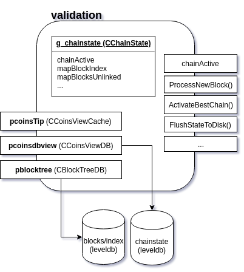
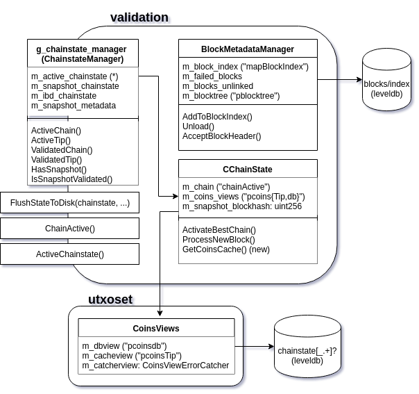

class: left, bottom, nonumber, title, split-33


## UTXO<br> .stroke[snapshots]

.column[
CL HQ<br /> New York City, New York, USA
]

.column[
[@jamesob](https://twitter.com/jamesob)<br />Chaincode Labs
]

.column[

]

---

## Agenda

0. What are we trying to do?
0. What did I implement?
0. Demo
0. Questions

<!--
0. Libs
0. Examples
   - Accepting a new block
   - Mining a block
   - Constructing a transaction
   - Looking up a transaction (`getrawtransaction`)
   - Building and maintaining a transaction index (`txindex`)
0. Future work
-->

---

class: nonumber

<div style="margin-top: 120px;"></div>

# WHAT DO WE WANT??
## .stroke[orders-of-magnitude-faster<br />node bootstrapping!]

 
---

class: nonumber

<div style="margin-top: 120px;"></div>
                          
# WHEN DO WE WANT IT??
## .stroke[in an amount of time that will allow a sober consideration of security trade-offs, adequate socialization, and thorough implementation testing!!!<br />(appox. 12-36mo™)]

---

class: center, middle, hasbg, nonumber

# how's this work?

---

## basics

- A fully-synced node generates a serialized version of the UTXO set along
  with some metadata (a snapshot)
  - right now it's just dumped to a ~3GB file

--

- The bootstrapping node 
  - reads this file in 
  - does sanity checks
  - loads the coins
  - fakes a chain
  - completes IBD (ahem) to network tip
  - starts background verification of the snapshot on a different chainstate
  
---

class: middle

```cpp
class SnapshotMetadata
{
public:
    uint256 m_utxo_contents_hash = {};
    uint256 m_best_block_hash = {};
    int m_height = -1;
    uint64_t m_coins_count = 0;
    uint64_t m_chain_tx_count = 0;
    bool m_validation_complete = false;
};
```

```cpp
# new RPC
dumptxoutset(file_path);
loadtxoutset(file_path);
```
 
---

## details

- The node will only serve blocks from the fully-validated chain

- `miner.cpp` will not generate blocks based off of an unvalidated snapshot
  chain

- The wallet consults `ChainActive()` only, whether it's from an unvalidated
  snapshot or not

- Syncing to the network tip is prioritized over validating the snapshot
  - shouldn't really matter since syncing to network tip should be pretty quick

---

## implementation requirements

- Use multiple (two) chainstates instead of one
  - multiple leveldb `chainstate` databases
  - mulitple `CCoinsView` hierarchies
  - multiple blockchains

--

- Remove the assumption of a single chainstate from the rest of the
  code
  - make `CChainState` methods use e.g. `m_chain` instead of `(g_)chainActive`
  - remove all instances of `chainActive`
  - make top-level validation calls parameterized by `CChainState*`

--

- Make networking code work with multiple chainstates
  - namespace some `CNodeState` data by chainstate
  - tweak, e.g., `FindNextBlocksToDownload()`

---

class: center, middle, hasbg, nonumber

# ✨ demo ✨

---

class: center, middle, hasbg, nonumber

# what'd you do to the code, you monster

---
 
### Chainstate before (now)

.center[<br />.caption[Chainstate now]]
  
---

### Chainstate after (`utxo-dumpload`)

.center[<br />.caption[Chainstate after]]

---

### get ready to see a lot of this

```diff
  {
      // Advertise our address
-     if (fListen && !IsInitialBlockDownload())
+     if (fListen && !ActiveChainstate()->IsInitialBlockDownload())
      {
```

### and this

```diff
// FlushStateToDisk generates a ChainStateFlushed callback, which we should avoid missing
-    if (pcoinsTip != nullptr) {
-        FlushStateToDisk();
+    for (std::shared_ptr<CChainState> chainstate : g_chainstate_manager.GetAll()) {
+        FlushStateToDisk(chainstate->GetCoinsCache());
     }
```

---

class: center, middle, hasbg, nonumber

# remember how ibd works?

---

## ibd

- `SendMessages()`: if we don't have any eligible peers we're currently
  syncing headers from, assign one and send `GETHEADERS`.
- (usually) peer replies with a `HEADERS` message, which we call
  `ProcessHeadersMessage()` on.
- `ProcessHeadersMessage()` queues a follow-on `HEADERS` request if our peer 
  sent over a message containing `MAX_HEADERS_RESULTS`.

--

- There is a clause for direct-fetching a block communicated from just-received
  headers (i.e. immediately queueing a `GETDATA`) if our tip is very recent,
  but that's not relevant here.

--

- Meanwhile in `SendMessage()`, we use `FindNextBlocksToDownload()` to request
  up to `MAX_BLOCKS_IN_TRANSIT_PER_PEER` blocks.

---


```diff
+  std::vector<std::shared_ptr<CChainState>> chainstates_to_service;
+
+  // Service the snapshot chainstate first - more important to get to the
+  // network's tip quickly than do the background validation on the
+  // snapshot.
+  // TODO jamesob: is this what we really want?
+  //
+  if (g_chainstate_manager.m_snapshot_chainstate) {
+      chainstates_to_service.push_back(g_chainstate_manager.m_snapshot_chainstate);
+  }
+  chainstates_to_service.push_back(g_chainstate_manager.m_ibd_chainstate);
+  int requests_available = MAX_BLOCKS_IN_TRANSIT_PER_PEER - state.nBlocksInFlight;
+
+  for (std::shared_ptr<CChainState> chainstate : chainstates_to_service) {
```
---

class: smallcode

<div style="position: absolute; left: 600px; top: 100px; font-size: 120px;">
😭
</div>

<pre class="remark-code" style="margin-top: 40px;">
<code class="remark-code" style="overflow: visible;">
 src/bench/block_assemble.cpp         |  15 +-
 src/bench/duplicate_inputs.cpp       |  13 +-
 src/chain.cpp                        |  15 ++
 src/chain.h                          |   3 +
 src/coins.h                          |   1 +
 src/dbwrapper.cpp                    |   7 +
 src/dbwrapper.h                      |   7 +
 src/index/base.cpp                   |  16 +-
 src/index/txindex.cpp                |   2 +-
 src/init.cpp                         | 210 +++++++++++---------
 src/interfaces/chain.cpp             |  28 +--
 src/interfaces/node.cpp              |  12 +-
 src/miner.cpp                        |   2 +-
 src/net_processing.cpp               | 277 +++++++++++++++++---------
 src/node/transaction.cpp             |   2 +-
 src/policy/fees.cpp                  |   2 +-
 src/qt/test/wallettests.cpp          |   2 +-
 src/rest.cpp                         |  27 +--
 src/rpc/blockchain.cpp               | 287 +++++++++++++++++----------
 src/rpc/mining.cpp                   |  32 +--
 src/rpc/rawtransaction.cpp           |  21 +-
 src/test/denialofservice_tests.cpp   |   4 +-
 src/test/miner_tests.cpp             |  70 +++----
 src/test/test_bitcoin.cpp            |  14 +-
 src/test/txvalidationcache_tests.cpp |  43 ++--
 src/test/validation_block_tests.cpp  |  10 +-
 src/txdb.cpp                         |   2 +-
 src/txdb.h                           |  13 +-
 src/txmempool.h                      |  12 +-
 src/utxoset.h                        |  80 ++++++++
 src/validation.cpp                   | 809 ++++++++++++++++++++++++++++++++++++++++-----------------------------------
 src/validation.h                     | 883 +++++++++++++++++++++++++++++++++++++++++++++++++++++++++++++++++++++++++++++-----
 src/validationinterface.cpp          |   1 +
 src/wallet/rpcwallet.cpp             |   2 +-
 src/wallet/test/wallet_tests.cpp     |  20 +-
 src/wallet/wallet.cpp                |  15 +-
 test/functional/feature_dbcrash.py   |   3 +-
 <br />
 <b>37 files changed, 2067 insertions(+), 895 deletions(-)</b>
</code>
</pre>

---

# unsolved mysteries

- how should this affect pruning (which is almost certainly broken atm)?
- do we split `dbcache` down the middle?
- on-disk block locality might be adversely affected - how much does that
  matter?
- `cs_main` still be locking everything

--

<div style="margin-top: 80px;">
(not even gonna talk about an <code>assumeutxo</code> parameter, P2P changes, or -- god
  forbid -- a soft fork)
</div>

## .center[.stroke[12-36mo™]]

---

# todo

- mitigate diff size
- split into digestible commits
- write some (i.e. a lot of) tests
- q4u: how much refactoring should I attempt to roll into this project?
  - inclined to minimize, but also a good opportunity
  - lock-splitting, code-shuffling especially appealing while I'm in the
    neighborhood and have to touch `validation` anyway

---

class: left, bottom, nonumber, title, split-33

## .stroke[thanks]
